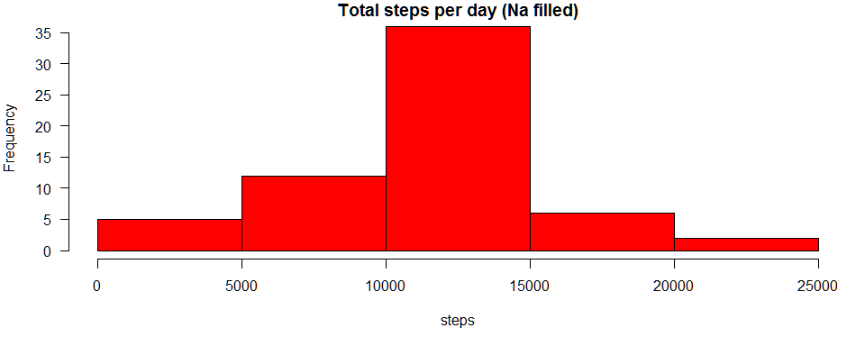

# Reproducible Research: Peer Assessment 1


## Loading and preprocessing the data

```r
# Extracting data if necessary (we suppose the zip file is already downloaded)
if(!file.exists("activity.csv")){
    # extract the data file from the zip file if necessary
    unzip("activity.zip", overwrite = TRUE)
}
#Loading data
activity <- read.csv("activity.csv", 
                     header = TRUE, 
                     sep = ",", 
                     colClasses = c("numeric", "Date", "numeric"))
```


## What is mean total number of steps taken per day?

```r
library(dplyr)
library(lattice)
# Total number of steps per day
daily_data <- summarise(group_by(activity, date), steps_tot = sum(steps, na.rm = TRUE))
# histogram of the total number of steps taken each day
par(mar=c(5, 4, 1, 1), las = 1)
with(daily_data,
     hist(steps_tot, 
          main = "Total steps per day", 
          xlab = "steps", 
          col = "red"))
```

 

```r
# Mean of total number of steps taken per day
mean(daily_data$steps_tot)
```

```
## [1] 9354.23
```

```r
# Median of total number of steps taken per day
median(daily_data$steps_tot)
```

```
## [1] 10395
```

## The average daily activity pattern

```r
interval_data <- summarise(group_by(activity, interval), steps_avg = mean(steps, na.rm = TRUE))
# Time series plot of the average number of steps taken across all days by interval
par(mar=c(5, 4, 1, 1), las = 1)
with(interval_data, 
     plot(x = interval, 
          y = steps_avg, 
          type =  "l", 
          xlab = "5-minute interval", 
          ylab = "Average number of step taken"))
```

 

```r
# The 5-minute interval containing the maximum number of steps
interval_data[interval_data$steps_avg == max(interval_data$steps_avg),][[1]]
```

```
## [1] 835
```

## Imputing missing values

```r
# Total number of missing values in the dataset
sum(is.na(activity$steps))
```

```
## [1] 2304
```

```r
# List of 5-minute interval containing missing value
na_list <- unique(activity[is.na(activity$step),"interval"])
activity_new <- activity
# Filling in all of the missing values in the dataset
# The strategy : replace by the mean for that 5-minute interval
for(t in na_list) {
    activity_new[is.na(activity_new$step) & activity_new$interval == t,"steps"] <- as.numeric(interval_data[interval_data$interval == t, "steps_avg"])
    }
```

## Task 5 : Impact of missing value

```r
daily_data_new <- summarise(group_by(activity_new, date), steps_tot = sum(steps, na.rm = TRUE))
# Histogram of the total number of steps taken each day
par(mar=c(5, 4, 1, 1), las = 1)
with(daily_data_new,
     hist(steps_tot, 
          main = "Total steps per day (Na filled)", 
          xlab = "steps", 
          col = "red"))
```

 

```r
# the mean of total number of steps taken per day (Na filled)
mean(daily_data_new$steps_tot)
```

```
## [1] 10766.19
```

```r
# the median of total number of steps taken per day (Na filled)
median(daily_data_new$steps_tot)
```

```
## [1] 10766.19
```
There mean and the median are identical when using the na filling method.

## Differences in activity patterns between weekdays and weekends

```r
# Creating a new factor (dayType) with two levels - "weekday" and "weekend"
activity_new$dayType <- "weekday"
activity_new$dayType[weekdays(activity_new$date) %in% c("samedi","dimanche")] <- "weekend"
activity_new$dayType <- as.factor(activity_new$dayType)
# Panel plot of the average number of steps taken across all weekday days or weekend days by interval (-minute)
interval_data_new <- summarise(group_by(activity_new, interval, dayType), steps_avg = mean(steps, na.rm = TRUE))
par(mar=c(5, 4, 1, 1), las = 1)
xyplot( steps_avg ~ interval | dayType, 
        data = interval_data_new, 
        type = "l", 
        layout = c(1,2),
        xlab = "Interval",
        ylab = "Number of steps")
```

 
